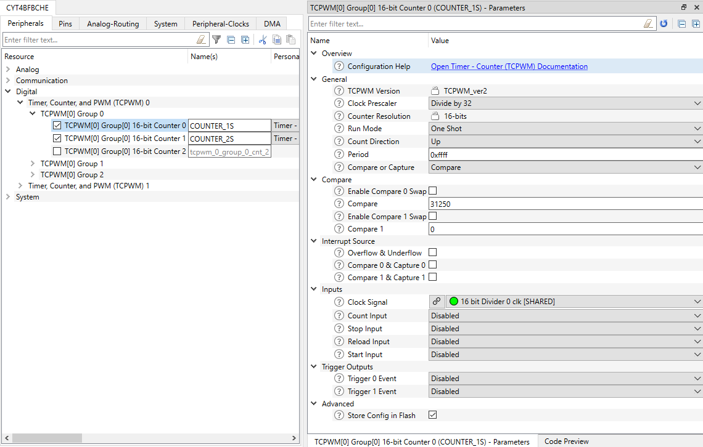
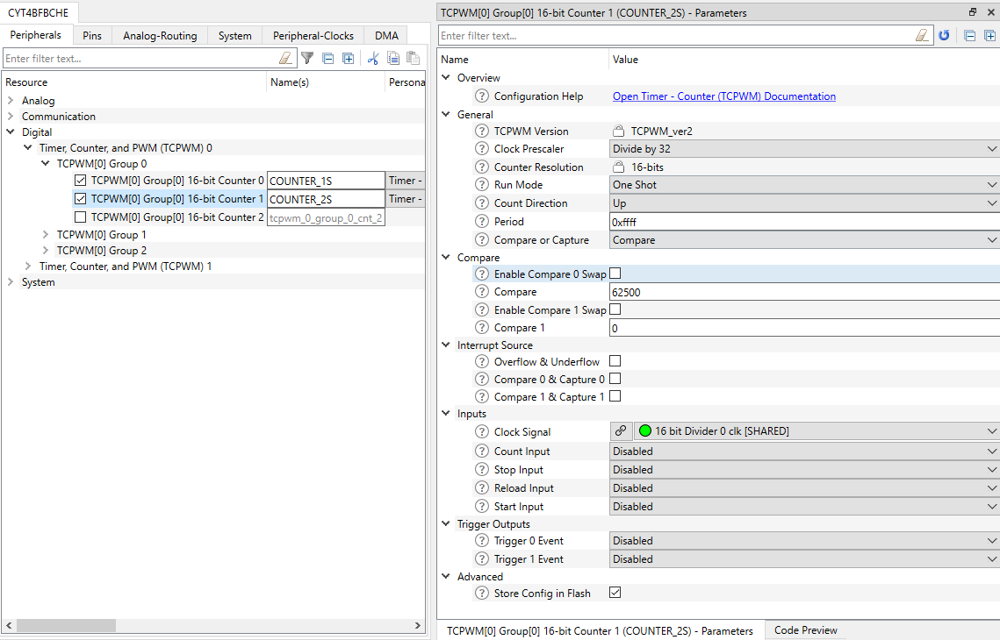
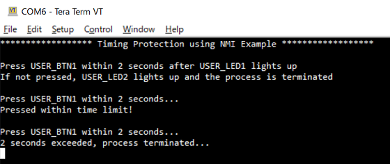

# INTERRUPT NMI Timing Protection
**This code example demonstrates the Timing Protection configuration using Non Maskable Interrupt (NMI), shows its operation, initial setting, and interrupt handling.**  

## Device
The device used in this code example (CE) is:
- [TRAVEO™ T2G CYT4BF Series](https://www.infineon.com/cms/en/product/microcontroller/32-bit-traveo-t2g-arm-cortex-microcontroller/32-bit-traveo-t2g-arm-cortex-for-body/traveo-t2g-cyt4bf-series/)

## Board
The board used for testing is:
- TRAVEO™ T2G evaluation kit (`KIT_T2G-B-H_EVK`, `KIT_T2G-B-H_LITE`)

## Scope of work
In this example, the Interrupt Service Routine (ISR) processing time is protected. If the processing time limit is exceeded, an NMI is generated and appropriate action can be taken.

## Introduction  

**Interrupts**  
TRAVEO™ T2G platform supports the following interrupt features:
- Supports up to 1023 system interrupts
    - Eight Cortex-M7 external interrupts and eight Cortex-M7 internal (software only) interrupts. The CPU supports up to 
240 interrupts, but only sixteen interrupts are used by the TRAVEO™ T2G interrupt infrastructure. The eight external 
CPU interrupts support DeepSleep (WIC) functionality.
    - Eight Cortex-M0+ external interrupts and eight Cortex-M0+ internal (software only) interrupts. The CPU supports up to 
32 interrupts, but only sixteen interrupts are used by the TRAVEO™ T2G interrupt infrastructure. The eight external 
CPU interrupts support DeepSleep (WIC) functionality.
    - All the available system interrupt sources are usable in Active power mode and can wake up from Sleep power mode
    - A subset of available system interrupt sources capable of waking the device from DeepSleep power mode
    - Four system interrupts can be mapped to each of the CPU NMI
- Nested vectored interrupt controller (NVIC) integrated with each CPU core, yielding low interrupt latency
- Wakeup interrupt controller (WIC) enabling interrupt detection (CPU wakeup) in DeepSleep power mode
- Vector table may be placed in either flash or SRAM
- Configurable priority levels (eight levels for Cortex-M7 and four levels for Cortex-M0+) for each interrupt
- Level-triggered interrupt signals

More details can be found in [Technical Reference Manual (TRM)](https://www.cypress.com/documentation/technical-reference-manuals/traveo-ii-automotive-body-controller-high-family), [Registers TRM](https://www.cypress.com/documentation/technical-reference-manuals/traveo-t2g-tvii-b-h-8m-registers-body-controller-high) and [Data Sheet](https://www.cypress.com/documentation/datasheets/cyt4bf-datasheet-32-bit-arm-cortex-m7-microcontroller-traveo-ii-family).

## Hardware setup
This CE has been developed for:
- TRAVEO™ T2G evaluation kit (`KIT_T2G-B-H_EVK`) 
 
No changes are required from the board's default settings.

## Implementation
This design consists of two TCPWM counters, two user LEDs, and a user button. The counter is set to run at 1Hz and generate interrupt subject to processing time protection. When the ISR is activated, it first starts another counter running with 2Hz. The second counter generates an NMI to detect that the ISR processing time has exceeded 2s. Then waits until the user button is pressed. If the button is not pressed within 2s, an NMI is generated.

**STDOUT setting**

Initialization of the GPIO for UART is done in the [cy_retarget_io_init()](https://infineon.github.io/retarget-io/html/group__group__board__libs.html#ga21265301bf6e9239845227c2aead9293) function.
- Initialize the pin specified by CYBSP_DEBUG_UART_TX as UART TX, the pin specified by CYBSP_DEBUG_UART_RX as UART RX (these pins are connected to KitProg3 COM port)
- The serial port parameters becomes to 8N1 and 115200 baud

**GPIO port pin initialization**

Initialization of the GPIO port pin is done once in the [Cy_GPIO_Pin_Init()](https://infineon.github.io/mtb-pdl-cat1/pdl_api_reference_manual/html/group__group__gpio__functions__init.html#gad61553f65d4e6bd827eb6464a7913461) function.
- Initialize the pin specified by CYBSP_USER_LED1/CYBSP_USER_LED2 as output (initial level = H, LED turns off)
- Initialize the pin specified by CYBSP_USER_BTN as input

**TCPWM initialization**

API calls for the TCPWM initialization is done in `init_Timer()` function.
- To initialize TCPWM counters, [Cy_TCPWM_Counter_Init()](https://infineon.github.io/mtb-pdl-cat1/pdl_api_reference_manual/html/group__group__tcpwm__functions__counter.html#ga6068a06ddc8a07c67bb6df86e920944c) is called with using structure [cy_stc_tcpwm_counter_config_t](https://infineon.github.io/mtb-pdl-cat1/pdl_api_reference_manual/html/structcy__stc__tcpwm__counter__config__t.html) which are auto-coded by Device Configurator as argument

    - *Figure 1. 1s counter setting* 
    - *Figure 2. 2s counter setting* 

- Then both counters are enabled by [Cy_TCPWM_Counter_Enable()](https://infineon.github.io/mtb-pdl-cat1/pdl_api_reference_manual/html/group__group__tcpwm__functions__counter.html#ga1707e2cc291fe486fbea346157c65bff), and their Compare 0 interrupt is enabled by [Cy_TCPWM_SetInterruptMask()](https://infineon.github.io/mtb-pdl-cat1/pdl_api_reference_manual/html/group__group__tcpwm__functions__common.html#ga47ec0d6214c01f67774fb97b9c3f0878)
- For enroll 2s counter to generate NMI exception on its expiration, [Cy_SysInt_SetNmiSource()](https://infineon.github.io/mtb-pdl-cat1/pdl_api_reference_manual/html/group__group__sysint__functions.html#ga3163ed7de473929acded134fc67ab997) is called
- Next, register a handler for each counter by [Cy_SysInt_Init()](https://infineon.github.io/mtb-pdl-cat1/pdl_api_reference_manual/html/group__group__sysint__functions.html#gab2ff6820a898e9af3f780000054eea5d)
- Last, `NVIC_EnableIRQ()` is called to enable IRQ

**Start 1s counter**

If main loop detects the 1s counter is not started, it calls `start_TCPWM_Counter()` function to start it.
- At first it clears the counter by calling [Cy_TCPWM_Counter_SetCounter()](https://infineon.github.io/mtb-pdl-cat1/pdl_api_reference_manual/html/group__group__tcpwm__functions__counter.html#gab1b0e66e97b06eb7fb2ab14aabab7975)
- Then it triggers the counter by calling [Cy_TCPWM_TriggerStart_Single()](https://infineon.github.io/mtb-pdl-cat1/pdl_api_reference_manual/html/group__group__tcpwm__functions__common.html#gaafe86ec440bec9a2c23392f289cc3a8b)

**ISR of 1s counter**

The ISR function for 1s counter is `handle_TCPWM_Counter_Interrupt()`.
- At first, checking if the intended interrupt has occurred by [Cy_TCPWM_GetInterruptStatusMasked()](https://infineon.github.io/mtb-pdl-cat1/pdl_api_reference_manual/html/group__group__tcpwm__functions__common.html#gabb00d4f53ff5db82aa6f5e5ae0e79f8a) before start ISR process
- Then, After clearing the interrupt by [Cy_TCPWM_ClearInterrupt()](https://infineon.github.io/mtb-pdl-cat1/pdl_api_reference_manual/html/group__group__tcpwm__functions__common.html#ga0c7a2d667dc983c82327463529f5d283), start the 2s counter which expiration set as NMI by calling `start_TCPWM_Counter()` function to protect timing
- Next, the LED indicating the start of the ISR process is lit by calling [cyhal_gpio_write()](https://infineon.github.io/psoc6hal/html/group__group__hal__gpio.html#gaf66e7c3ed7b3b0711635d7687ae92291), and waits until the user button is pressed by calling [cyhal_gpio_read()](https://infineon.github.io/psoc6hal/html/group__group__hal__gpio.html#ga3d38f1dd86c2e74b8ad10f1f6d1945c2)
- Once the user button is pressed, stop the 2s counter by calling [Cy_TCPWM_TriggerStopOrKill_Single()](https://infineon.github.io/mtb-pdl-cat1/pdl_api_reference_manual/html/group__group__tcpwm__functions__common.html#gad1459b0ddabf388afe151de57f7cf4d4) and turn off the LED by calling [cyhal_gpio_write()](https://infineon.github.io/psoc6hal/html/group__group__hal__gpio.html#gaf66e7c3ed7b3b0711635d7687ae92291)

**Detection of timing overruns**

If the processing time of the ISR is not finished within 2sec, `handle_NMI_Exception()` function will be called as NMI exception.
- The confirmation and clearing of interrupt is same as the ISR of 1sec counter
- In this example, the action of timing overrun detection is only to lit the LED by [gpio_hal_write()](https://infineon.github.io/psoc6hal/html/group__group__hal__gpio.html#gaf66e7c3ed7b3b0711635d7687ae92291), but it can be implemented other action to ensure the safety of the system

## Run and Test
For this example, a terminal emulator is required for displaying outputs. Install a terminal emulator if you do not have one. Instructions in this document use [Tera Term](https://ttssh2.osdn.jp/index.html.en).

After code compilation, perform the following steps to flashing the device:
1. Connect the board to your PC using the provided USB cable through the KitProg3 USB connector.
2. Open a terminal program and select the KitProg3 COM port. Set the serial port parameters to 8N1 and 115200 baud.
3. Program the board using one of the following:
    - Select the code example project in the Project Explorer.
    - In the **Quick Panel**, scroll down, and click **[Project Name] Program (KitProg3_MiniProg4)**.
4. After programming, the code example starts automatically. Confirm that the messages are displayed on the UART terminal.

    - *Figure 3. Terminal output on program startup* 

5. You can debug the example to step through the code. In the IDE, use the **[Project Name] Debug (KitProg3_MiniProg4)** configuration in the **Quick Panel**. For details, see the "Program and debug" section in the [Eclipse IDE for ModusToolbox™ software user guide](https://www.cypress.com/MTBEclipseIDEUserGuide).

**Note:** **(Only while debugging)** On the CM7 CPU, some code in `main()` may execute before the debugger halts at the beginning of `main()`. This means that some code executes twice ? once before the debugger stops execution, and again after the debugger resets the program counter to the beginning of `main()`. See [KBA231071](https://community.cypress.com/docs/DOC-21143) to learn about this and for the workaround.

## References  

Relevant Application notes are:
- AN235305 - GETTING STARTED WITH TRAVEO™ T2G FAMILY MCUS IN MODUSTOOLBOX™
- [AN224434](https://www.infineon.com/dgdl/Infineon-AN224434_Clock_Configuration_Setup_in_Traveo_II_Family_CYT4B_Series-ApplicationNotes-v03_00-EN.pdf?fileId=8ac78c8c7cdc391c017d0d3a71ec674a) - Clock configuration setup in TRAVEO™ T2G family CYT4B series
- [AN219842](https://www.infineon.com/dgdl/Infineon-AN219842_How_to_use_interrupt_in_TRAVEO_II-ApplicationNotes-v07_00-EN.pdf?fileId=8ac78c8c7cdc391c017d0d3a490a6732) - How to use interrupt in TRAVEO™ II
- <a href="https://www.infineon.com/dgdl/Infineon-AN220224_How_to_Use_Timer_Counter_and_PWM_(TCPWM)_in_Traveo_II_Family-ApplicationNotes-v04_00-EN.pdf?fileId=8ac78c8c7cdc391c017d0d3a800a6752">AN220224</a> - How to Use Timer, Counter, and PWM (TCPWM) in Traveo II Family

ModusToolbox™ is available online:
- <https://www.infineon.com/modustoolbox>

Associated TRAVEO™ T2G MCUs can be found on:
- <https://www.infineon.com/cms/en/product/microcontroller/32-bit-traveo-t2g-arm-cortex-microcontroller/>

More code examples can be found on the GIT repository:
- [TRAVEO™ T2G Code examples](https://github.com/orgs/Infineon/repositories?q=mtb-t2g-&type=all&language=&sort=)

For additional trainings, visit our webpage:  
- [TRAVEO™ T2G trainings](https://www.infineon.com/cms/en/product/microcontroller/32-bit-traveo-t2g-arm-cortex-microcontroller/32-bit-traveo-t2g-arm-cortex-for-body/traveo-t2g-cyt4bf-series/#!trainings)

For questions and support, use the TRAVEO™ T2G Forum:  
- <https://community.infineon.com/t5/TRAVEO-T2G/bd-p/TraveoII>  
